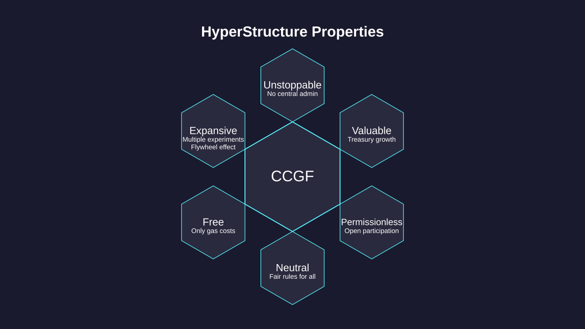

# CCGF

## A self-sustaining engine for public goods funding

This document describes an experimental framework for sustainable public goods funding, specifically designed to support [_decentralized science_](https://ethereum.org/en/desci/) (**DeSci**) projects.

The **Continuous Convertible Grants Framework** (CCGF) aims to become a [_HyperStructure_](https://jacob.energy/hyperstructures.html)—an unstoppable, free, valuable, and expansive system that can perpetually support scientific advancement.

Inspired by successful mechanisms like [_Quadratic Funding_](https://www.wtfisqf.com/), [_StreamingQF_](https://github.com/Geo-Web-Project/streaming-quadratic-funding), and [_Gardens_](https://www.gardens.fund/), CCGF represents an evolution of these approaches designed to create greater impact across the **DeSci ecosystem**.

If you are new to [_Web3_](#user-content-fn-1)[^1] and these terms, we suggest reading [**Appendix 1: Glossary & Key Concepts**](appendices/appendix-1-glossary-and-key-concepts.md) first. Please be aware of the risks associated with cryptocurrencies by reading [**Appendix 2: Risk Factors**](appendices/appendix-2.md).

This is an evolving experiment, starting with the launch of [**$MEGAPI**](tokenomics/megapi.md) token and [_Gardens_-based governance](governance/governance-participation/gardens.md).

<figure><figcaption>
<strong>Continuous Convertible Grants Framework</strong>
</figcaption></figure>

[^1]: Distributed ledger technology; blockchain.
