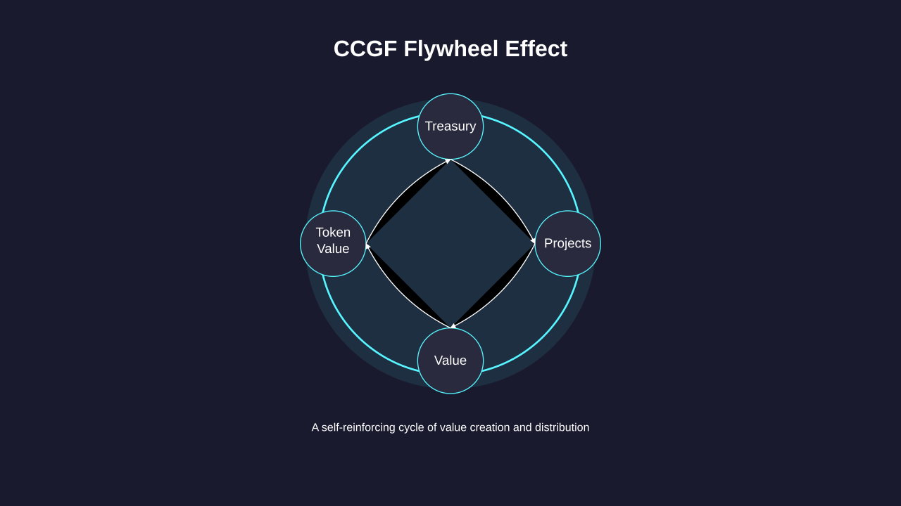

# The Mechanism

At its core, CCGF uses a token-tied matching pool instead of direct grants:

1. Treasury holds ecosystem tokens.
2. Projects receive continuous token streams via different experimental funding mechanisms.
3. Success drives token value.
4. Projects pledge to voluntarily contribute value back to the treasury through convertible mechanisms.
5. Projects can be punished for violating rules by slashing the staking of proposers or using other similar mechanisms.

**This creates a flywheel effect:**

_More projects → More value creation → Higher token value → Larger treasury → More projects_

<figure><figcaption>
<strong>CCGF Flywheel Effect</strong>
</figcaption></figure>

